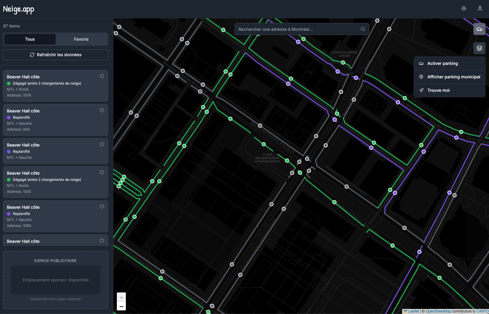

# neige.app



A comprehensive application to retrieve and manage Montreal snow removal planning data from the PlanifNeige API, with a Next.js frontend and automated data fetching via cron jobs.

## Description

This project consists of:

- **Backend**: Python scripts to fetch snow removal planification data from the PlanifNeige API and store it in Supabase
- **Frontend**: Next.js web application for displaying and managing the data
- **Automation**: Cron jobs to automatically fetch and update planification data hourly

## Project Structure

```
neigeapp/
├── client/                          # Next.js frontend application
│   ├── app/                         # Next.js app directory
│   │   ├── (main)/                  # Main application routes
│   │   │   ├── admin/               # Admin pages
│   │   │   ├── api/                 # API routes
│   │   │   ├── contact/             # Contact page
│   │   │   ├── lp/                  # Landing pages
│   │   │   └── page.tsx             # Home page
│   │   ├── (standalone)/            # Standalone app routes
│   │   ├── globals.css              # Global styles
│   │   └── i18n/                    # Internationalization
│   │       ├── locales/             # Translation files (en, fr)
│   │       └── settings.js          # i18n configuration
│   ├── components/                  # React components
│   │   ├── ui/                      # UI component library (shadcn/ui)
│   │   ├── auth-modal.tsx           # Authentication modal
│   │   ├── map.tsx                  # Map component
│   │   ├── navbar.tsx               # Navigation bar
│   │   └── ...                      # Other components
│   ├── hooks/                       # React hooks
│   ├── lib/                         # Utility libraries
│   │   ├── api.ts                   # API client
│   │   ├── auth.ts                  # Authentication utilities
│   │   ├── supabase-server.ts       # Supabase server client
│   │   └── ...                      # Other utilities
│   ├── package.json                 # Node.js dependencies
│   └── next.config.js               # Next.js configuration
├── supabase/                        # Supabase configuration
│   │   └── migrations/              # Database migrations
├── data/                            # Data files
│   └── gbdouble.json                # Street mapping data
│
├── logs/                            # Application logs
│   ├── fetch_planifications_*.log   # Timestamped execution logs
│   └── fetch_planifications_errors.log  # Error log
│
├── planification_batches/           # Batch processing output
│   └── planification_batch_*.json   # JSON batch files
│
├── test/                            # Test scripts
│   ├── fetch_planifications.py      # Test script for fetching
│   └── test.py                      # General tests
│
├── venv/                            # Python virtual environment (created by setup)
│
├── fetch_planifications_batch.py    # Main script to fetch and process planifications
├── load_municipal_parking.py        # Script to load municipal parking data
├── run_fetch_planifications.sh      # Cron wrapper script
├── setup.sh                         # Initial setup script
├── setup_cron.sh                    # Cron job setup script
├── requirements.txt                 # Python dependencies
└── README.md                        # This file
```

## Environment Setup

### Prerequisites

- Python 3.8+ (for backend scripts)
- Node.js 18+ and npm (for frontend)
- Supabase account and project
- PlanifNeige API token

### 1. Python Environment Setup

#### Quick Setup (Recommended)

Run the setup script to automatically create the virtual environment and install dependencies:

```bash
./setup.sh
```

This will:

- Create the virtual environment (`venv/`)
- Activate it
- Upgrade pip
- Install all dependencies from `requirements.txt`

#### Manual Setup

1. **Create Virtual Environment:**

   ```bash
   python3 -m venv venv
   ```

2. **Activate Virtual Environment:**

   **On macOS/Linux:**

   ```bash
   source venv/bin/activate
   ```

   **On Windows:**

   ```bash
   venv\Scripts\activate
   ```

3. **Install Dependencies:**

   ```bash
   pip install -r requirements.txt
   ```

   **Note:** You may need to install additional dependencies that aren't in `requirements.txt`:

   ```bash
   pip install supabase shapely psycopg2-binary requests
   ```

### 2. Environment Variables

Please contact me if you need supabase access.

Create a `.env` file in the project root with the following variables:

````bash
# PlanifNeige API Configuration
UserName=your_name
UserEmail=your_email@example.com
TokenString=your_planif_neige_token


# Supabase Configuration
SUPABASE_SERVICE_ROLE_KEY=your_service_role_key
SUPABASE_URL=https://your-project.supabase.co
``'

**Environment Variable Reference:**

- `UserName`: Your name or identifier for PlanifNeige API access
- `UserEmail`: Your email used for PlanifNeige API
- `TokenString`: Your PlanifNeige API authentication token
- `SUPABASE_URL`: URL of your Supabase project (e.g., `https://your-project.supabase.co`)
- `SUPABASE_SERVICE_ROLE_KEY`: Supabase service role key (required for backend/server operations)
- `BATCH_OUTPUT_DIR`: (Optional) Output directory for batch files, defaults to `planification_batches` if unset

**Security Tip:**
Never commit your `.env` file to version control—this file is already excluded by `.gitignore` for your safety.

### 3. Frontend Setup

Navigate to the client directory and install dependencies:

```bash
cd client
npm install
````

Create a `.env.local` file in the `client/` directory for frontend environment variables:

```bash
NEXT_PUBLIC_SUPABASE_URL=https://your-project.supabase.co
NEXT_PUBLIC_SUPABASE_ANON_KEY=your_anon_key
```

## Database Schema & Data Flow

### Supabase Tables

The application uses several Supabase tables to store and manage snow removal data:

#### Core Tables

**1. `streets`** - Street geometry and metadata

- `cote_rue_id` (bigint, PK) - Unique identifier for each street side
- `id_trc`, `id_voie` - Internal street identifiers
- `nom_voie` (text) - Street name
- `nom_ville` (text) - City name
- `debut_adresse`, `fin_adresse` (int) - Address range
- `cote` (text) - Street side (e.g., "N", "S", "E", "W")
- `geometry` (geography) - PostGIS LineString geometry (SRID 4326)
- `street_feature` (jsonb) - Complete GeoJSON feature data
- `created_at`, `updated_at` (timestamptz) - Timestamps

**2. `deneigement_current`** - Current snow removal status

- `cote_rue_id` (bigint, PK, FK → streets) - Street side reference
- `etat_deneig` (smallint) - Snow removal state code (0-4)
- `status` (text) - Human-readable status description
  - `0`: "Non planifié"
  - `1`: "Planifié"
  - `2`: "Replanifié"
  - `3`: "Sera replanifié ultérieurement"
- `date_debut_planif` (timestamptz) - Planned start date
- `date_fin_planif` (timestamptz) - Planned end date
- `date_debut_replanif` (timestamptz) - Rescheduled start date
- `date_fin_replanif` (timestamptz) - Rescheduled end date
- `date_maj` (timestamptz) - Last update date from API
- `last_seen_at` (timestamptz) - Last time record was verified

**3. `deneigement_events`** - Audit trail of status changes

- `id` (bigserial, PK) - Unique event identifier
- `cote_rue_id` (bigint, FK → streets) - Street side reference
- `old_etat`, `new_etat` (smallint) - Previous and new state codes
- `old_status`, `new_status` (text) - Previous and new status descriptions
- `event_date` (timestamptz) - When the change occurred (from API)
- `created_at` (timestamptz) - When the event was recorded

#### User Tables

**4. `user_favorites`** - User bookmarked streets

- `user_id` (uuid, FK → auth.users) - User identifier
- `cote_rue_id` (bigint, FK → streets) - Street side reference
- `created_at` (timestamptz) - When favorited
- Primary key: `(user_id, cote_rue_id)` - Prevents duplicates

**5. `parking_locations`** - User-saved parking locations

- `id` (uuid, PK) - Unique identifier
- `user_id` (uuid, FK → auth.users) - User identifier
- `latitude`, `longitude` (double precision) - Coordinates
- `name` (text) - Custom name
- `notes` (text) - Additional notes
- `created_at`, `updated_at` (timestamptz) - Timestamps

**6. `municipal_parking`** - Public municipal parking data

- `id` (uuid, PK) - Unique identifier
- `station_id` (text, unique) - Station identifier
- `borough` (text) - Borough name
- `number_of_spaces` (integer) - Number of parking spaces
- `latitude`, `longitude` (double precision) - Coordinates
- `jurisdiction` (text) - Jurisdiction type
- `location_fr`, `location_en` (text) - Location descriptions
- `hours_fr`, `hours_en` (text) - Operating hours
- `note_fr`, `note_en` (text) - Additional notes
- `payment_type` (text) - Payment method
- `geometry` (geometry Point) - PostGIS Point geometry
- `created_at`, `updated_at` (timestamptz) - Timestamps

### Data Flow Logic

The data processing pipeline works as follows:

#### 1. Data Fetching (`fetch_planifications_batch.py`)

```
PlanifNeige API → Download gbdouble.json → Fetch Planifications → Batch Processing
```

**Step-by-step process:**

1. **Download Street Data**: Downloads the latest `gbdouble.json` from Montreal's open data portal

   - Source: https://donnees.montreal.ca/dataset/geobase-double
   - Creates a mapping of `cote_rue_id` → GeoJSON features

2. **Fetch Planifications**: Calls PlanifNeige API to get all planifications since the current date

   - Uses SOAP API via `zeep` library
   - Retrieves planification data for all street sides

3. **Batch Processing**: Splits planifications into smaller batches (default: 100 items)

   - Saves batches as JSON files in `planification_batches/`
   - Enables parallel processing and error recovery

4. **Parallel Ingestion**: Processes batches concurrently using ThreadPoolExecutor
   - Default: 5 workers (configurable via `MAX_WORKERS`)
   - Each worker processes one batch file

#### 2. Data Ingestion Logic

For each planification item:

```
Check if street exists → Upsert street → Check current state → Detect changes → Insert event → Upsert current
```

**Detailed flow:**

1. **Street Validation & Upsert**:

   - Checks if `cote_rue_id` exists in `streets` table
   - If missing, attempts to insert from `gbdouble.json` mapping
   - Upserts street with geometry and metadata
   - Uses PostGIS for spatial operations when `DATABASE_URL` is available

2. **State Change Detection**:

   - Retrieves current state from `deneigement_current` table
   - Compares `etat_deneig` (state code) with new data
   - Detects if status has changed

3. **Event Logging**:

   - If state changed, inserts record into `deneigement_events`
   - Captures both old and new states
   - Records `event_date` from API's `dateMaj` field

4. **Current State Update**:
   - Upserts into `deneigement_current` table
   - Updates all planification dates and status
   - Sets `last_seen_at` timestamp

#### 3. Error Handling

- **Missing Streets**: If a street doesn't exist, the script attempts to create it from `gbdouble.json`
- **Foreign Key Violations**: Retries street insertion before failing
- **Connection Pooling**: Uses PostgreSQL connection pooling for efficient database access
- **Thread Safety**: Each thread uses its own Supabase client and database connection

#### 4. Row Level Security (RLS)

All tables have RLS enabled with appropriate policies:

- **Public Read Access**: `streets`, `deneigement_current`, `deneigement_events`, `municipal_parking`
- **Authenticated Write**: System operations require authentication
- **User-Specific**: `user_favorites` and `parking_locations` are user-scoped

### Database Indexes

Optimized indexes for common queries:

- **Streets**: `nom_voie`, `nom_ville`, `street_feature` (GIN), `geometry` (GIST)
- **deneigement_current**: `etat_deneig`, `status`, `date_maj`
- **deneigement_events**: `(cote_rue_id, event_date DESC)`, `created_at DESC`
- **user_favorites**: `user_id`, `cote_rue_id`
- **parking_locations**: `user_id`, `created_at DESC`
- **municipal_parking**: `station_id`, `borough`, `geometry` (GIST)

### Migration Files

Database migrations are located in `supabase/migrations/`:

- `streets.sql` - Streets table with PostGIS support
- `20251219_create_deneigement_current.sql` - Current status table
- `20251219_create_deneigement_events.sql` - Events audit table
- `20251219_create_user_favorites.sql` - User favorites
- `20250121_create_parking_locations.sql` - Parking locations
- `20250122_create_municipal_parking.sql` - Municipal parking
- Additional indexes and functions

## Cron Job Setup

The project includes automated hourly fetching of planification data using cron jobs.

### Quick Setup

Run the cron setup script:

```bash
./setup_cron.sh
```

This will:

- Make the wrapper script executable
- Create a `logs/` directory
- Add a cron job that runs every hour at minute 0
- Set up proper logging

### Manual Setup

1. **Make the wrapper script executable:**

   ```bash
   chmod +x run_fetch_planifications.sh
   ```

2. **Create logs directory:**

   ```bash
   mkdir -p logs
   ```

3. **Edit your crontab:**

   ```bash
   crontab -e
   ```

4. **Add this line (replace with your actual project path):**
   ```
   0 * * * * /absolute/path/to/neigeapp/run_fetch_planifications.sh
   ```

### Cron Schedule

The default cron job runs every hour at minute 0:

- `0 * * * *` means: minute 0 of every hour, every day

**Common schedule examples:**

- Every 30 minutes: `*/30 * * * *`
- Every 15 minutes: `*/15 * * * *`
- Every 2 hours: `0 */2 * * *`
- At specific times: `0 8,12,18 * * *` (8 AM, 12 PM, 6 PM)

### Viewing and Managing Cron Jobs

**View current cron jobs:**

```bash
crontab -l
```

**Remove the cron job:**

```bash
crontab -e
# Then delete the line containing run_fetch_planifications.sh
```

**Remove all cron jobs:**

```bash
crontab -r
```

### Logs

Logs are stored in the `logs/` directory:

- **Individual run logs**: `logs/fetch_planifications_YYYYMMDD_HHMMSS.log` - Timestamped log for each execution
- **Error log**: `logs/fetch_planifications_errors.log` - Consolidated error log

### macOS Specific Notes

On macOS, you may need to grant Full Disk Access to cron:

1. Go to **System Settings** > **Privacy & Security** > **Full Disk Access**
2. Click the **+** button
3. Navigate to `/usr/sbin/cron` and add it
4. Restart your Mac or run:
   ```bash
   sudo launchctl stop com.apple.cron
   sudo launchctl start com.apple.cron
   ```

For more detailed cron setup information, see [CRON_SETUP.md](./CRON_SETUP.md).

## Running the Application

### Backend Scripts

**Make sure your virtual environment is activated first!**

**Run the planification fetcher manually:**

```bash
source venv/bin/activate
python fetch_planifications_batch.py
```

### Frontend Development

**Start the Next.js development server:**

```bash
cd client
npm run dev
```

The application will be available at `http://localhost:3000`

**Build for production:**

```bash
cd client
npm run build
npm start
```

## API Endpoints (Legacy FastAPI)

If you have a FastAPI server (not currently in use), the endpoints would be:

- `GET /` - Root endpoint with API information
- `GET /health` - Health check endpoint
- `GET /planifications?from_date=YYYY-MM-DDTHH:MM:SS` - Get all planifications since a date (defaults to 60 days ago)

## Troubleshooting

### Virtual Environment Issues

If you encounter issues with the virtual environment:

```bash
# Remove and recreate
rm -rf venv
./setup.sh
```

### Cron Job Not Running

1. **Check if cron is running:**

   ```bash
   # On macOS
   sudo launchctl list | grep cron
   ```

2. **Test the wrapper script manually:**

   ```bash
   ./run_fetch_planifications.sh
   ```

3. **Check script permissions:**

   ```bash
   ls -l run_fetch_planifications.sh
   # Should show: -rwxr-xr-x (executable)
   ```

4. **View system logs:**
   ```bash
   # macOS
   log show --predicate 'process == "cron"' --last 1h
   ```

### Environment Variables Not Loading

Ensure your `.env` file is in the project root and contains all required variables. The script uses `python-dotenv` to load environment variables.

## Additional Resources

- [CRON_SETUP.md](./CRON_SETUP.md) - Detailed cron setup documentation
- Supabase Documentation: https://supabase.com/docs
- Next.js Documentation: https://nextjs.org/docs
